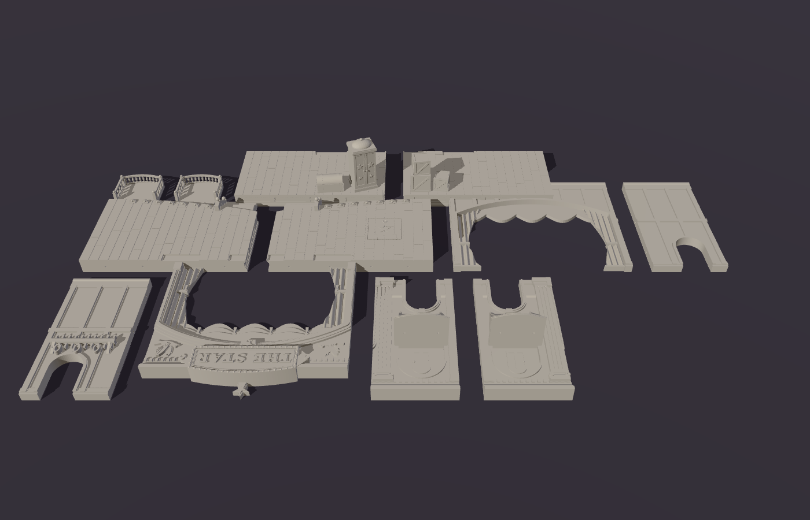

# models-and-things

3D-printable models generated from code (Python + [manifold3d](https://github.com/elalish/manifold)).

## The Star Theater (Malifaux)

Colette Du Bois' Star Theater, as tabletop terrain for Malifaux / D&D at ~32 mm heroic scale.
The battle map comes in two halves that face each other across the table:

1. **The stage** (this piece, done): `terrain/star_theater/stage.py`
2. **The seating** (coming next)


| Front | Backstage |
|---|---|
|  |  |
|  |  |

### What's on it

* **Stage base:** 400 × ~230 mm, 20 mm tall. The planked floor has staggered butt joints. A curved
  apron extends ~110 mm in front of the wall, with recessed skirt panels, a star medallion,
  shell-hooded footlights and a magician's trapdoor marked with a star. Three steps lead down
  from each front corner.
* **Proscenium wall:** 20 mm thick and 170 mm above the deck, standing across the middle of the base.
  * The segmental arch opening is 200 mm wide and ~130 mm tall. It has a stepped moulding, a
    keystone, fluted pilasters, a dentil cornice, tied-back main drapes and a swagged valance
    with tassels.
  * The **"THE STAR"** marquee rises above the cornice, ringed with bulbs and topped with a star.
    Two of Colette's clockwork doves sit in relief on either side of it.
  * Each side wall has a **usable opera box**: a bowed balcony 108 mm above the deck with turned
    balusters and newel posts. Inside the rails it's about 52 × 44 mm, room for a 40 mm base.
    The top is open, so you can reach in to place models.
  * Under each box, a **36 × 50 mm door** leads backstage, so 30 mm bases fit through.
* **Backstage:** ~100 mm deep behind the wall. The back of the wall shows its timber framing
  and has a pin rail with coiled ropes. Props include stacked crates, a costume trunk and an
  illusionist's cabinet.

### Printing: 12 parts, already oriented



The model was designed around how it prints, so the seams fall where they're easy to hide and easy
to print. Run `python -m terrain.star_theater.stage`. It writes `output/star_theater/stage_assembled.stl`
(a preview of the whole thing) and the parts in `output/star_theater/print/`. Each part is
already rotated into its print orientation and sitting on z = 0, so you can drop it straight into
the slicer.

| Part | Footprint (mm) | How it prints |
|---|---|---|
| `deck_front_left` / `_right` | 202 × 139 | flat, top up |
| `deck_back_left` / `_right` | 202 × 108 | flat, top up (props included) |
| `wall_front_centre` | 218 × 201 | lying on its back: the split face on the bed, audience side up |
| `wall_front_left` / `_right` | 91 × 172 | lying on its back; the box bracket points up |
| `wall_back_centre` | 218 × 172 | lying on its front: split face down, backstage side up |
| `wall_back_left` / `_right` | 91 × 172 | lying on its front |
| `balcony_left` / `_right` | 58 × 52 | upright, so the balusters stand vertically |

"Left" and "right" are as seen from the audience. Everything fits a 220 × 220 mm bed.

**How it's split:**

* **The wall splits lengthwise** down its centre line (10 mm + 10 mm). Both halves print with the cut face
  on the bed, so all the relief faces up. Anything that hangs into an opening reaches back to the cut
  face, so nothing starts in mid-air: the curtains, the valance and its tassels, the marquee and its star.
  The curtains show folds on both sides.
* **The wall also splits into left, centre and right** at x = ±109 mm, just outside the arch, so the
  curtains stay whole on the centre piece.
* **The deck splits into quarters.** The front/back seam runs under the wall. The left/right seam falls
  on a plank line, and the trapdoor sits off-centre so the seam misses it.
* **The opera balconies print separately** and sit on brackets built into the wall's front half. Each
  bracket's underside slopes at about 45°.

**Joinery:**

* Every seam has **2.1 mm holes for 1.75 mm filament pins**. Cut the filament to 8–10 mm lengths.
  There are 8 holes per deck seam, 10 between the wall halves, 6 per wall side seam, and 2 per balcony.
* The wall's **2 mm tenon** drops into a matching **slot in the deck**, with 0.2 mm clearance. The
  tenon also bridges the deck's front/back seam.
* Glue as you go. Suggested order: pin and glue the deck quarters together. Assemble each wall half,
  then glue the two halves together. Drop the wall into the deck slot, then pin the balconies on.

**Overhang check:** the build runs `terrain/common/printcheck.py` on every part in its print
orientation. It reports any downward-facing surface steeper than 45° that isn't on the bed. What's
left is all small: 0.8 mm steps under the deck lip and the cabinet crown, the 2 mm pin holes, crate
bottoms crossing the floor grooves, and the balcony top rail bridging ~5 mm between balusters. No
supports are needed. The finest details are about 1.6 mm (baluster necks), which is fine for a
0.4 mm nozzle or resin.

### Coordinates / conventions

Units are millimetres. X runs left/right and Z is up. **+Y points toward the audience.** The wall's
front face is at y = 0 and its back face at y = −20, with the split plane at y = −10. Viewed from
the audience, +X is on the viewer's *left*, so text on front-facing surfaces is mirrored in code
(`text_section(..., mirror=True)`).

## Development

```sh
pip install -r requirements.txt
python -m terrain.star_theater.stage          # build STLs + overhang report (~5 s)

# optional: preview renders (headless Chromium via Playwright + three.js)
(cd tools/render && npm install)
node tools/render/render.mjs output/star_theater/stage_assembled.stl docs/star_theater/stage hero front back
python -m tools.render.layout output/star_theater/print /tmp/plate.stl   # all parts on one "plate"
node tools/render/render.mjs /tmp/plate.stl docs/star_theater/print plate
```

Shared CSG helpers live in `terrain/common/csg.py`. They cover extrusion in each principal
plane, offset rings for mouldings, stars, gears, segmental arches, text outlines and binary
STL export.
