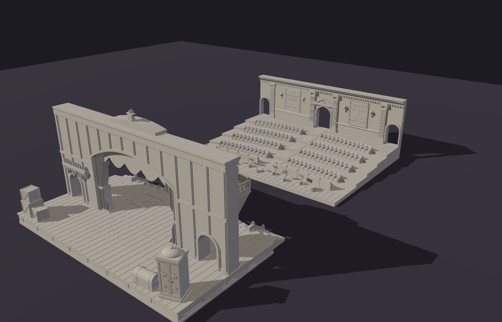
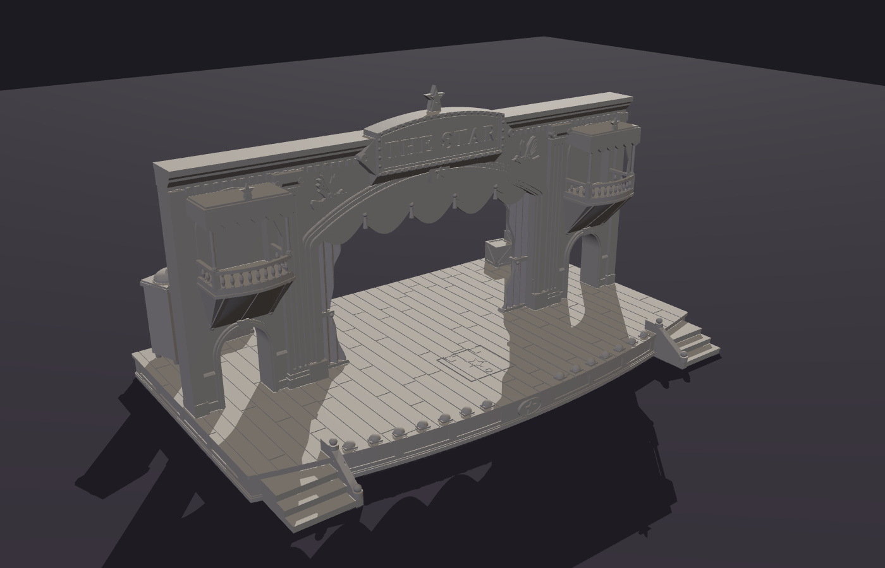
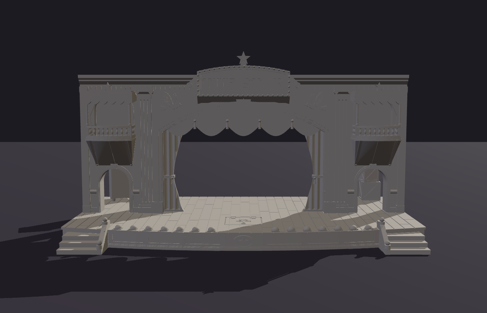
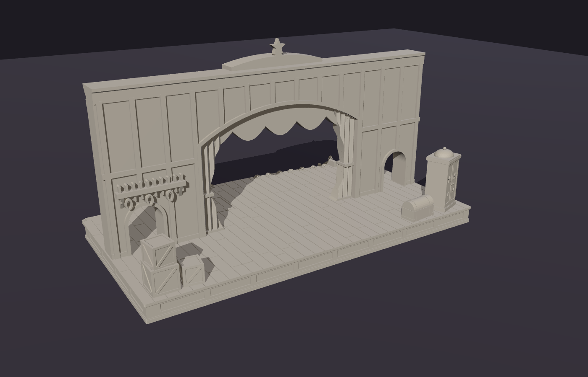
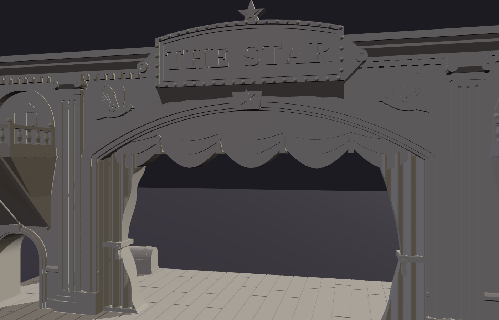
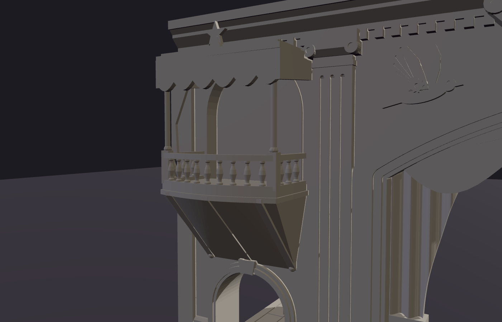
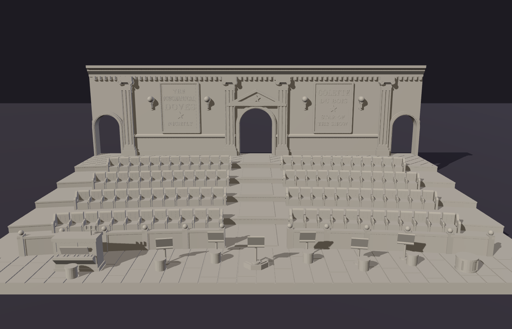
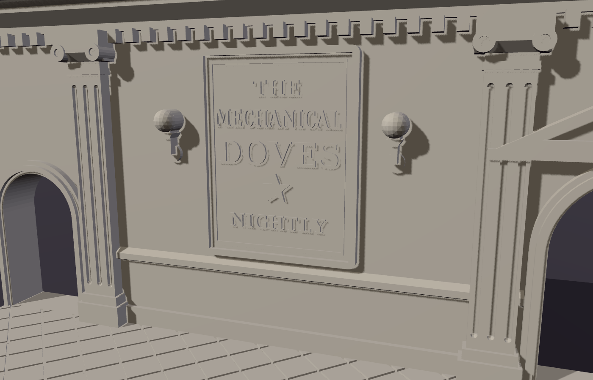
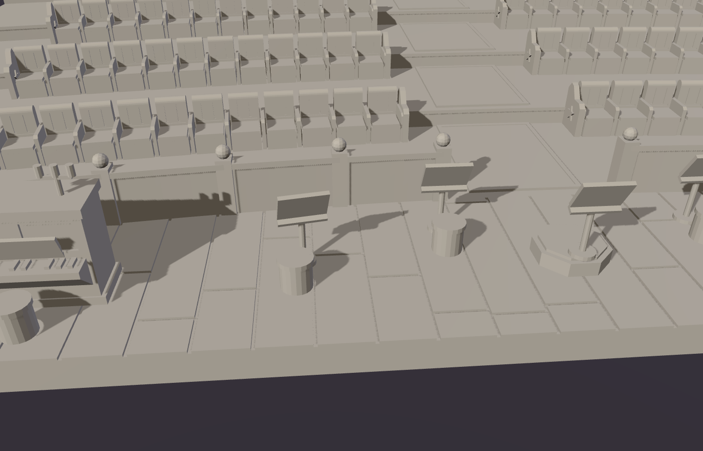

# models-and-things

3D-printable models generated from code (Python + [manifold3d](https://github.com/elalish/manifold)).

## The Star Theater (Malifaux)

Colette Du Bois' Star Theater, as tabletop terrain for Malifaux / D&D at ~32 mm heroic scale.
The battle map comes in two halves that face each other across the table:

1. **The stage:** `terrain/star_theater/stage.py`
2. **The seating:** `terrain/star_theater/seating.py`



`python -m terrain.star_theater.scene [gap_mm]` writes `theater_scene.stl` with the two halves set
out facing each other (the gap defaults to 150 mm). Each half is 400 mm wide. The stage is ~246 mm
deep and the seating ~304 mm, so a 3' × 3' table leaves about 360 mm for the gap.

## Part one: the stage



| Front | Backstage |
|---|---|
|  |  |
|  |  |

### What's on it

* **Stage base:** 400 × ~230 mm, 20 mm tall. The planked floor has staggered butt joints. A curved
  apron extends ~110 mm in front of the wall, with recessed skirt panels, a star medallion,
  shell-hooded footlights and a magician's trapdoor marked with a star. Three steps lead down
  from each front corner.
* **Proscenium wall:** 20 mm thick and 170 mm above the deck, standing across the middle of the base.
  * The segmental arch opening is 200 mm wide and ~130 mm tall. It has a stepped moulding, a
    keystone, fluted pilasters, a dentil cornice, tied-back main drapes and a swagged valance
    with tassels.
  * The **"THE STAR"** marquee rises above the cornice, ringed with bulbs and topped with a star.
    Two of Colette's clockwork doves sit in relief on either side of it.
  * Each side wall has a **usable opera box**: a bowed balcony 108 mm above the deck with turned
    balusters and newel posts. Inside the rails it's about 52 × 44 mm, room for a 40 mm base.
    The top is open, so you can reach in to place models.
  * Under each box, a **36 × 50 mm door** leads backstage, so 30 mm bases fit through.
* **Backstage:** ~100 mm deep behind the wall. The back of the wall shows its timber framing
  and has a pin rail with coiled ropes. Props include stacked crates, a costume trunk and an
  illusionist's cabinet.

### Printing: 12 parts, already oriented


The model was designed around how it prints, so the seams fall where they're easy to hide and easy
to print. Run `python -m terrain.star_theater.stage`. It writes `output/star_theater/stage_assembled.stl`
(a preview of the whole thing) and the parts in `output/star_theater/print/`. Each part is
already rotated into its print orientation and sitting on z = 0, so you can drop it straight into
the slicer.

| Part | Footprint (mm) | How it prints |
|---|---|---|
| `deck_front_left` / `_right` | 202 × 139 | flat, top up |
| `deck_back_left` / `_right` | 202 × 108 | flat, top up (props included) |
| `wall_front_centre` | 218 × 201 | lying on its back: the split face on the bed, audience side up |
| `wall_front_left` / `_right` | 91 × 172 | lying on its back; the box bracket points up |
| `wall_back_centre` | 218 × 172 | lying on its front: split face down, backstage side up |
| `wall_back_left` / `_right` | 91 × 172 | lying on its front |
| `balcony_left` / `_right` | 58 × 52 | upright, so the balusters stand vertically |

"Left" and "right" are as seen from the audience. Everything fits a 220 × 220 mm bed.

**How it's split:**

* **The wall splits lengthwise** down its centre line (10 mm + 10 mm). Both halves print with the cut face
  on the bed, so all the relief faces up. Anything that hangs into an opening reaches back to the cut
  face, so nothing starts in mid-air: the curtains, the valance and its tassels, the marquee and its star.
  The curtains show folds on both sides.
* **The wall also splits into left, centre and right** at x = ±109 mm, just outside the arch, so the
  curtains stay whole on the centre piece.
* **The deck splits into quarters.** The front/back seam runs under the wall. The left/right seam falls
  on a plank line, and the trapdoor sits off-centre so the seam misses it.
* **The opera balconies print separately** and sit on brackets built into the wall's front half. Each
  bracket's underside slopes at about 45°.

**Joinery:**

* Every seam lines up with **4.5 mm steel BBs** (".177 caliber" airgun BBs, which are cheap in packs of
  thousands). Each face gets a half-sphere pocket, and the ball centres the two parts as they close.
  Glue the plastic faces as usual; the ball is trapped between them. Real BBs run about 4.35–4.5 mm.
  If yours differ, change `BALL_D` in `terrain/common/csg.py` and rebuild. There are 8 per deck seam,
  10 between the wall halves, 6 per wall side seam, and 2 per balcony.
* The wall's **2 mm tenon** drops into a matching **slot in the deck**, with 0.2 mm clearance. The
  tenon also bridges the deck's front/back seam.
* Glue as you go. Suggested order: pin and glue the deck quarters together. Assemble each wall half,
  then glue the two halves together. Drop the wall into the deck slot, then pin the balconies on.

**Overhang check:** the build runs `terrain/common/printcheck.py` on every part in its print
orientation. It reports any downward-facing surface steeper than 45° that isn't on the bed. What's
left is all small: 0.8 mm steps under the deck lip and the cabinet crown, the domed tops of the BB
pockets, crate bottoms crossing the floor grooves, and the balcony top rail bridging ~5 mm between
balusters. No
supports are needed. The finest details are about 1.6 mm (baluster necks), which is fine for a
0.4 mm nozzle or resin.

## Part two: the seating



| Rows | Back wall | Orchestra pit |
|---|---|---|
|  |  |  |

* **Orchestra pit** along the front edge: a planked floor with an upright piano (with candelabra),
  the conductor's podium, five music stands with stools, and a drum. A curved rail with ball-topped
  posts separates it from the house.
* **Four raked rows** of velvet theatre chairs, curved toward the stage and each 6 mm higher than the
  last. There are 96 chairs, with tufted backs and armrests, plus cast-iron end panels with stars on
  the aisles.
  * Each row leaves ~33 mm of standing room in front of the chairs, so 30 mm bases fit between rows.
  * The centre aisle is 44 mm wide with a carpet runner. The side aisles are 32 mm.
* **Rear walkway** with a diamond-tiled floor, 24 mm above the pit floor.
* **Back wall**, matching the stage:
  * Pilasters and a dentil cornice.
  * A 40 mm double doorway under a pediment with a star, and a 30 mm doorway at each side aisle.
  * Gas sconces and two framed playbills: *"COLETTE DU BOIS ★ STAR OF THE SHOW"* and
    *"THE MECHANICAL DOVES ★ NIGHTLY"*.

### Printing the seating: 7 parts


| Part | Footprint (mm) | How it prints |
|---|---|---|
| `seating_floor_front_left` / `_right` | 200 × 152 | flat (pit, rows 1–2) |
| `seating_floor_back_left` / `_right` | 200 × 171 | flat (rows 3–4, walkway) |
| `seating_wall_centre` | 84 × 111 | lying on its plain back, decoration up |
| `seating_wall_left` / `_right` | 158 × 111 | lying on its plain back |

* The floor splits down the centre aisle and along the front edge of row 3. That seam follows the
  curve and hides at the foot of a step.
* The back wall has a flat back (it faces the lobby, or the table edge), so it prints lying on it
  in one layer. It splits just outside the centre pilasters.
* Joinery is the same as the stage: BB pockets on every seam (4 on the aisle seam, 6 on the curved
  seam, 4 on the wall seams), and a wall tenon that drops into a slot in the walkway.
* Overhang check: nothing needs supports. The only flags are the pocket domes, a 0.6 mm lip on the
  piano lid, and the music-stand desks, which cantilever ~5 mm either side of their posts. The desks
  are tiny, but they're the one spot where a slow outer-wall speed helps.

## Coordinates / conventions

Units are millimetres. X runs left/right and Z is up. **+Y points toward the audience** (on the seating piece too, where y = 0 is the pit edge facing the stage). The wall's
front face is at y = 0 and its back face at y = −20, with the split plane at y = −10. Viewed from
the audience, +X is on the viewer's *left*, so text on front-facing surfaces is mirrored in code
(`text_section(..., mirror=True)`).

## Development

```sh
pip install -r requirements.txt
python -m terrain.star_theater.stage          # stage STLs + overhang report (~5 s)
python -m terrain.star_theater.seating        # seating STLs + overhang report (~4 s)
python -m terrain.star_theater.scene          # both halves together, for previews

# optional: preview renders (headless Chromium via Playwright + three.js)
(cd tools/render && npm install)
node tools/render/render.mjs output/star_theater/stage_assembled.stl docs/star_theater/stage hero front back
python -m tools.render.layout output/star_theater/print /tmp/plate.stl   # all parts on one "plate"
node tools/render/render.mjs /tmp/plate.stl docs/star_theater/print plate
```

Shared CSG helpers live in `terrain/common/csg.py`. They cover extrusion in each principal
plane, offset rings for mouldings, stars, gears, segmental arches, text outlines, BB pockets and
binary STL export. `terrain/common/printcheck.py` handles overhang/bed checks and print orientation.
Theatre ornaments shared by both halves (pilasters, the clockwork dove) live in
`terrain/star_theater/ornament.py`.
