# Reaper VIP: Steel Jackhammer's penthouse (Cy_Borg)

The penthouse from *Reaper VIP*, the Cy_Borg starter adventure (by Christian Sahlén, art by
Johan Nohr), as 32 mm tabletop terrain. It's a cutaway of the whole flat: low walls you can reach
over, rooms furnished from the map's notes, and the building corridor outside the front door where
the guards stand.

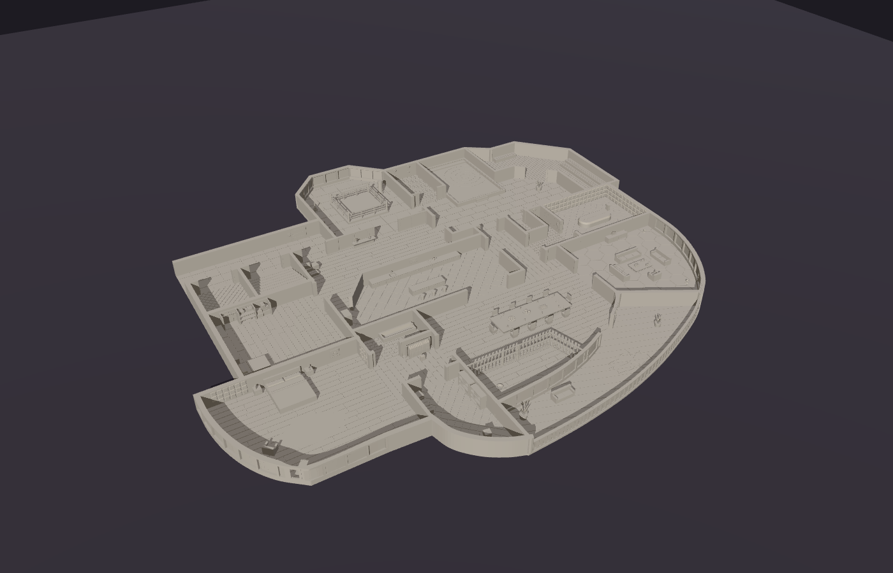

* **Size:** about 815 × 725 mm, laid out like the map (north up). That fits a 1 m × 2 m table with
  room to spare along the long side.
* **Scale:** the map is traced at 1 pixel = 1 mm, which happens to suit 30–40 mm bases. The dining
  room is ~270 mm across, the guest room ~155 mm, and the WC (the tightest room) ~37 mm.
* **Walls:** 25 mm above the floor, 5 mm thick inside and 7 mm outside. The floor slab is 3 mm.
  Walls drawn as double lines on the map (windows) are glass: a sill, a thin pane, mullions and a
  head rail. The dashed walls are glass partitions (gym, shower, sauna) or doorways.
* **Doorways** are at least 36 mm wide, except the WC's (34 mm). There are no lintels.

`python -m projects.reaper_vip.penthouse` builds everything. `python -m projects.reaper_vip.tilemap`
redraws the tile map below.

## The rooms

The map's notes are copied out word for word below each room. The furniture comes from those notes.
Characters and creatures are left out of the model because they're minis (see the list further down).

| | |
|---|---|
| 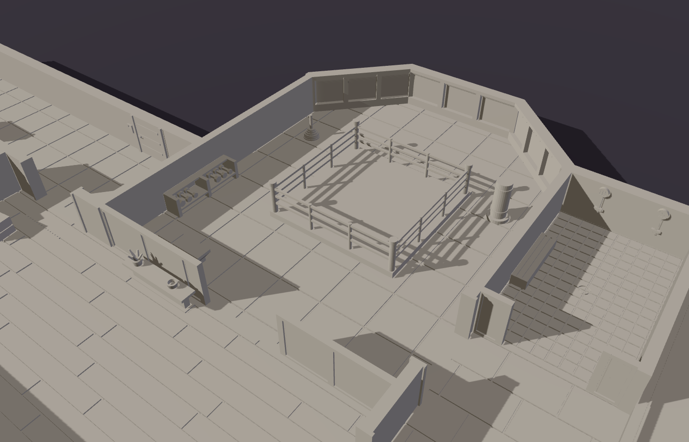 | 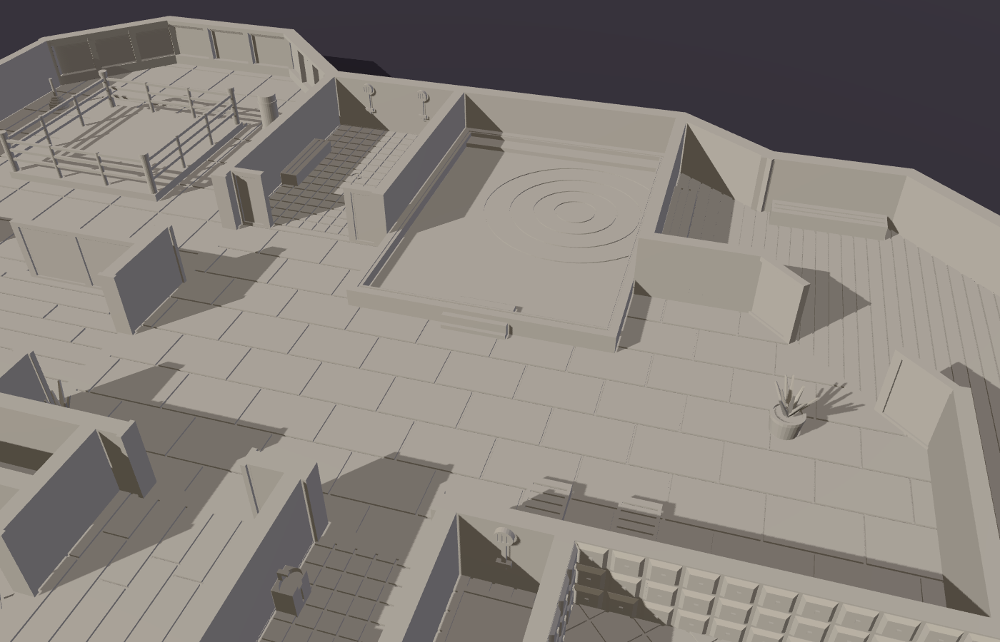 |
| 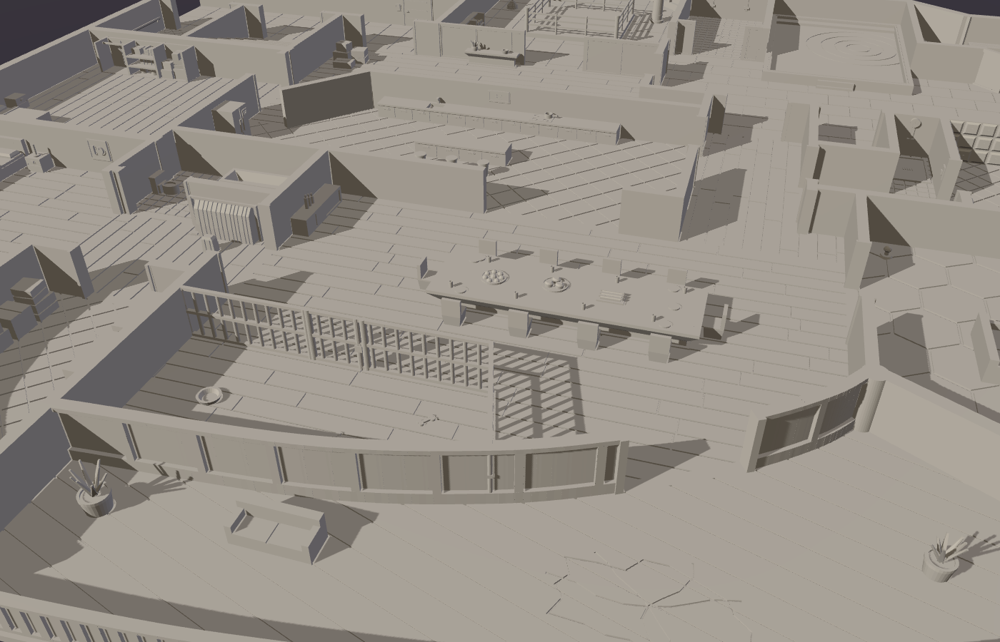 | 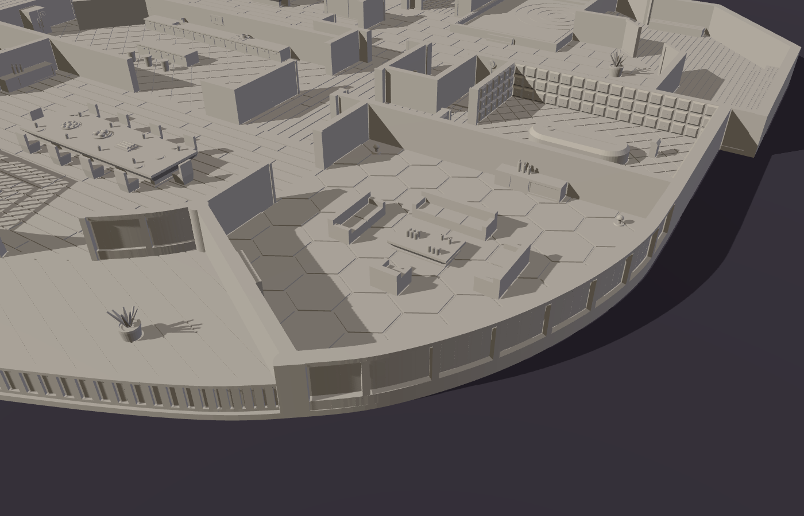 |
| 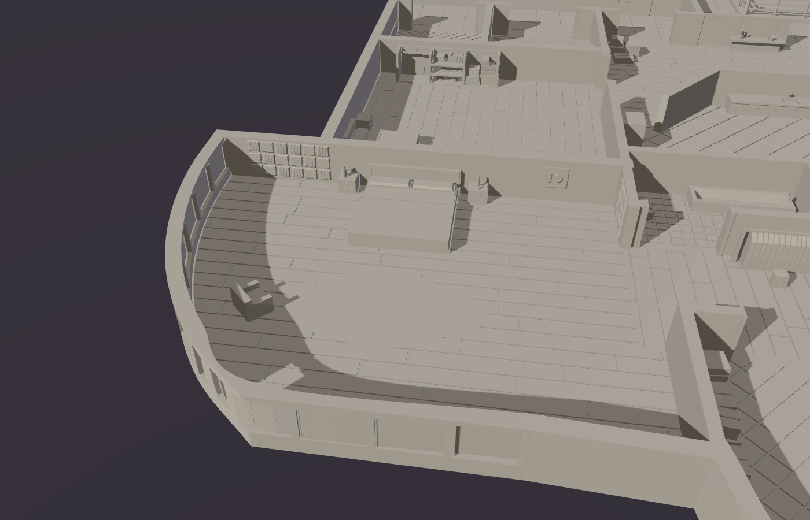 | 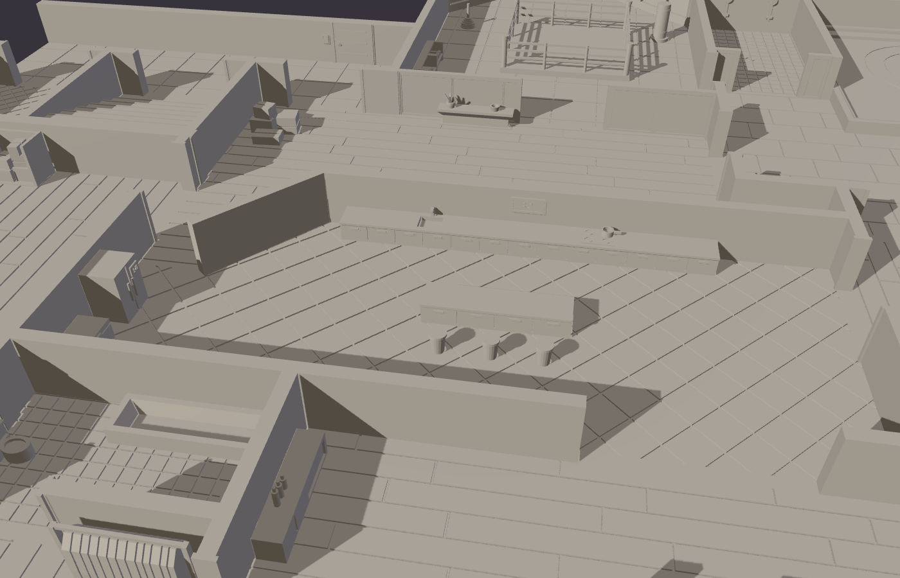 |
| 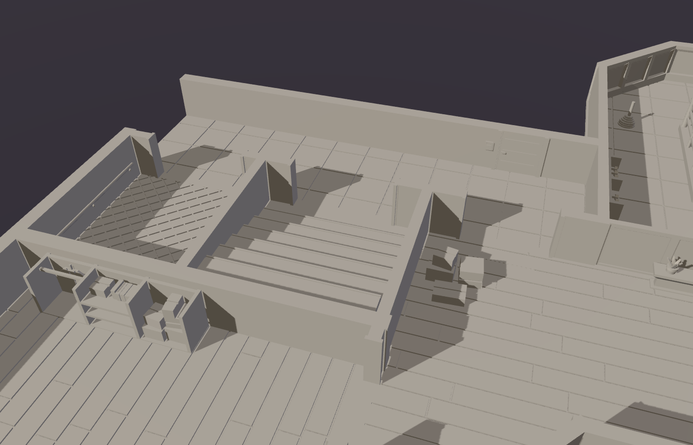 | 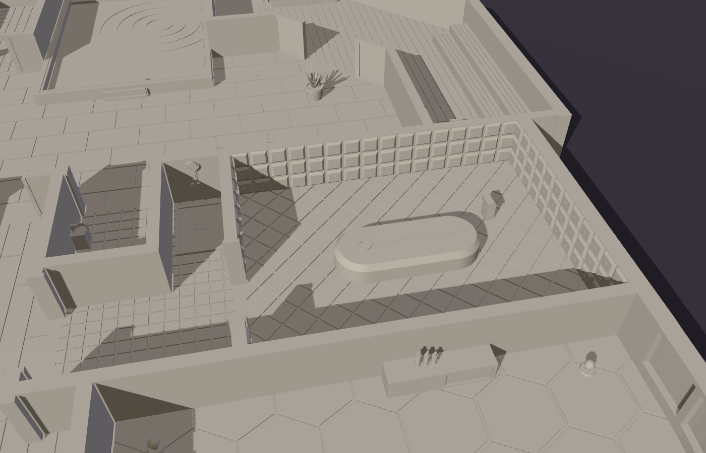 |
| 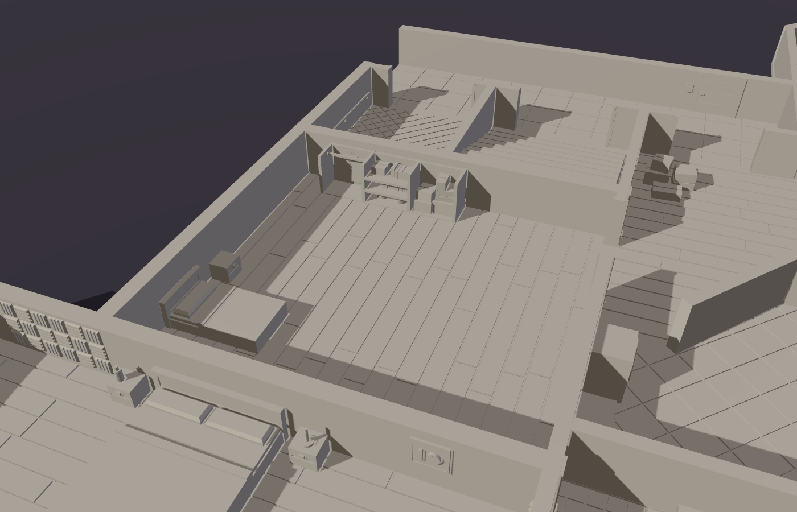 | 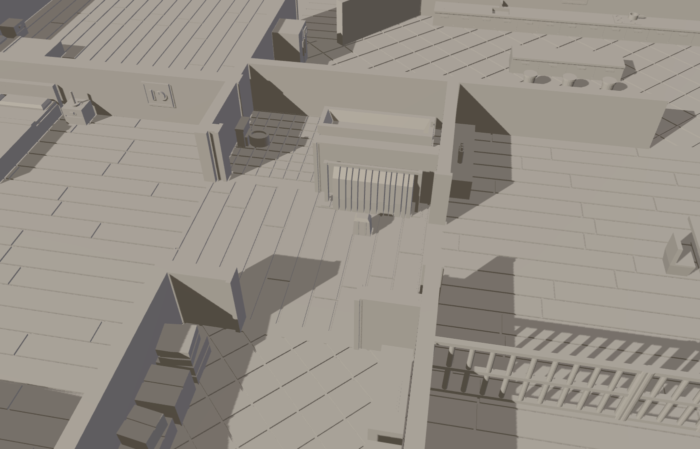 |

**Party People** (rule for every room): *"Upon entering a room for the first time, or after ~10
minutes have passed, roll a D6 and a D8: D6 the number of unnamed guests present; D8 the VIP present.
If appropriate, roll more than one D8 for VIPs."*

* **Corridor, lift, stairs** (building common area). Has the lift doors and a call panel, a
  handrail in the lift car, and a flight of stairs. The **neighbour's** door has a keypad. The
  corridor's west end is left open, as if it carries on. The flat's front door opens off the corridor.
* **Hallway.** *"Guests and deliveries coming and going. As soon as one dealer leaves, another one
  shows up."* Has a doormat, a pile of delivery parcels, a console table and a plant.
* **Gym.** *"Weights (the latest fad) and a cydroid sparring partner set to the highest difficulty.
  Attacks anyone entering the ring."* Has a raised sparring ring with ropes and steps, a hex-dumbbell
  rack, a plate tree, a heavy bag and a bench. The windows are glass, and it's open to the hallway
  through a glass partition with doors.
* **Shower / Hot-tub pool / Sauna / Spa.** Spa: *"Steamy from the hot-tub pool and sauna. Most
  guests are unarmed and a bit drowsy."*
  * The shower has a glass screen, two shower heads, a bench and a drain.
  * The hot tub is raised, with a rim, a seat ledge, steps and ripples on the water. Models can
    stand in it.
  * The spa has loungers, a side table with drinks, towels and plants.
  * The sauna has tiered slatted benches, a stove heaped with stones and a bucket and ladle, behind
    a glass partition.
* **Sensory deprivation chamber.** *"Black and padded. Water coffin. A button outside the door locks
  it, enables noise reduction and turns off the lights. No holoprojectors, so everyone here are flesh
  guests curious to see what a personal SDC looks like."* Has quilted padding on every wall, the
  float tank ("water coffin") with a porthole, and a control console. The lock button is on the
  outside of the door, in the little bathroom.
* **WC and bath.** These have a toilet, sinks and a shower tray.
* **Guest room.** *"Rarely used. Closet full of boxes with random, never used stuff. Pots and pans,
  old books and a tuxedo. Two packs of Faceblock in a drawer."* The open-fronted closet holds stacked
  boxes, shelves of pots and books, and a tuxedo on a rail. There's also a bed, a nightstand, and a
  dresser for the Faceblock.
* **Kitchen.** *"Never used for actual cooking. Full of Smart™ appliances longing for attention. A
  fridge stocked with drinks and a freezer with 10 doses of Blackout."* Has a long counter with a
  sink and hob, an island with stools, a fridge and a chest freezer. The Smart™ screens (wall, fridge,
  freezer) each show a needy little smiley face.
* **Master bedroom.** *"Soundproof, smells of incense and cleaning detergent. A small wall safe with
  nothing of value or interest. An otherwise-empty backpack in the closet contains a credstick with
  2.5k¤ and a dose of Vurt."*
  * Acoustic foam panels show the soundproofing. There's a big bed with nightstands, an incense
    burner, a detergent bottle, the wall safe, a rug, and an armchair by the curved window wall.
  * The walk-in **closet** between the bedroom, bath and dining room has a clothes rack and the
    backpack.
* **Storage.** Has crates and parcels, and two shelving units.
* **Dining room.** *"Half the room is barred off as a cage for two gene-spliced big cats. One with
  multi-colored stripes in its fur and the other being dark violet. A buffet is set up on the dining
  table: fresh oysters, seaweed burgers, synthmeat hot dogs and plenty more."*
  * The cage has bars, rails and a padlocked gate. Inside are a food bowl and chewed bones.
  * The 120 mm table seats ten, with platters of oysters, burgers and hot dogs, plates and glasses.
    There's a drinks cabinet too.
  * Sliding glass doors open onto the balcony.
* **Holo space.** *"Set up for multi-person holo entertainment. Canned and pre-mixed gin and tonics
  on the table. Cyber-Lich painting on the wall."*
  * Three sofas and an armchair face a low table of gin & tonic cans and glasses. There are three
    holo emitters, a drinks cabinet, and a hex-pattern holo floor.
  * **The Cyber-Lich painting is a separate part.** It hangs on two pegs on the diagonal wall. Lift
    it off and there's the safe:
    *"STEALING DATA. Behind the Cyber-Lich painting is a scan/EMP-shielded safe with a mechanical lock.
    Inside, a data chip with evidence of match fixing between Alliansen Inc. and TG Labs. It can be
    sold to a competitor's media, or to a PR-agent from either company for up to 9k¤. Publishing this
    will end Steel Jackhammer's career/life if it hasn't ended already."*
* **Balcony.** *"All supposedly bulletproof glass. A view to die for. No holo projectors, so flesh
  guests use it for more intimate conversations. When firing a gun, roll D4. On a 1, a large section
  of the floor breaks. Don't fall."* Has a glass rail, decking, a loveseat and plants. The section
  of floor that breaks is cut into the deck outside the sliding doors, with cracks running out of it.

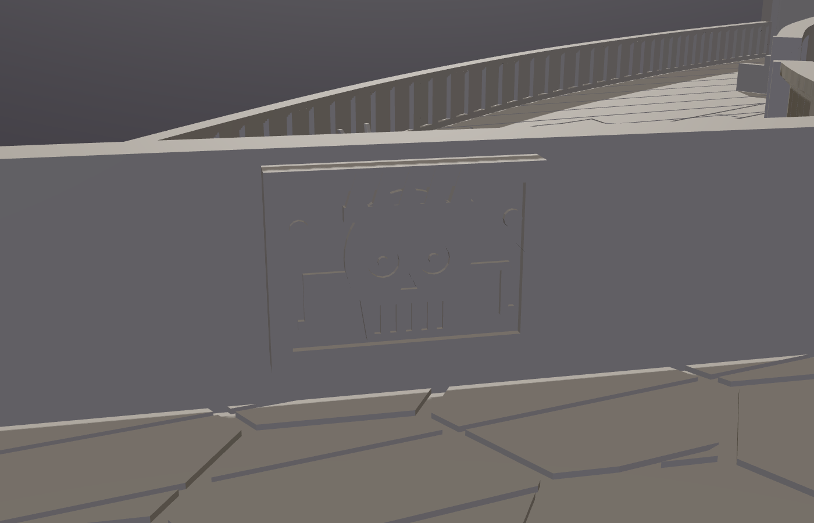

### How the map was read

I had to interpret a few parts of the map:

* **Dashed walls** became glass partitions with doors (gym/hallway, shower, sauna) or doorways.
* The grey strip along the top of the holo space wasn't modelled. In its place there's a drinks
  cabinet against that wall.
* The device drawn on the holo space's diagonal wall is where the painting hangs. The "Stealing data"
  note sits right under it.
* The WC and the little bath next to the chamber are as small on the map as they are here. A 30 mm
  base fits, but only just.

## Minis you'll want

Nothing here is in the model. This list comes from the full adventure page (stats are in the book).

| Who | How many | Where | Notes |
|---|---|---|---|
| Steel Jackhammer | 1 | Moves between the master bedroom, balcony, dining room and holo space (d4) | The target: a killmatch VIP with new chrome legs |
| Guards | 2 | Corridor, at the front door | Brutish but lazy: they check for heavy weapons and explosives |
| Sparring Cydroid | 1 | Gym, in the ring | Attacks anyone who enters the ring |
| Stripe & Shade | 2 big cats | Dining room cage | Gene-spliced: one with multicoloured stripes, one dark violet. Big bases suit them (the cage is ~150 × 75 mm) |
| VIPs (d8) | up to 8 | Anywhere (Party People table) | Zenit (killmatch feed writer), Ikhon (Nano-using athlete with a "warlock" persona), Thugger (cocky athlete with electro-taur horns), Raze (hacker with a gambling problem), Amande (pilots a small mech when fighting, so maybe a mech mini too), Master Crimson (Arvtagarna veteran), Goliathess (up-and-coming athlete), Jade Boomslang (scaled newcomer) |
| Party guests | up to 6 per room (d6) | Everywhere | Most are holo-avatars. The sensory chamber and the balcony only get flesh guests |
| Dealers | 1 or more | Hallway | "As soon as one dealer leaves, another one shows up." |
| Rival dealers | d4+1 | Hallway / anywhere | Random event 1 |
| Drone-suit punks | 4 | Balcony | Random event 6: they land on the balcony to kidnap Master Crimson |
| The PCs | | Corridor | |

Doc Joy (the client) isn't at the party. The holoprojected fans (random event 3) don't need minis.

## Printing: 15 parts, already oriented

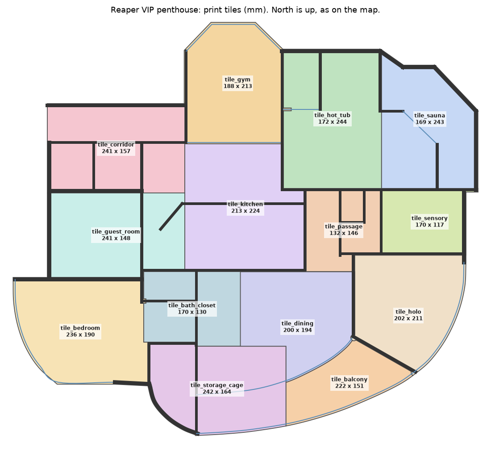

The flat is split into 14 floor tiles. Each one prints flat, floor down, with its walls and furniture
in place, so nothing needs gluing. The painting is the 15th part.

| Part | Footprint (mm) | ~g PLA |
|---|---|---|
| tile_gym | 174 × 213 | 162 |
| tile_hot_tub (shower, hot tub, west spa) | 172 × 244 | 170 |
| tile_sauna (sauna, east spa) | 169 × 243 | 155 |
| tile_corridor (corridor, lift, stairs, west hallway) | 241 × 198 | 190 |
| tile_kitchen (kitchen, hallway) | 213 × 224 | 179 |
| tile_guest_room | 241 × 148 | 153 |
| tile_bedroom | 236 × 196 | 179 |
| tile_bath_closet (bath, closet, west dining room) | 170 × 130 | 88 |
| tile_passage (passage, WC, small bath) | 132 × 146 | 87 |
| tile_sensory | 170 × 117 | 98 |
| tile_dining | 200 × 194 | 118 |
| tile_storage_cage (storage, cage, west balcony) | 242 × 164 | 176 |
| tile_holo | 195 × 208 | 133 |
| tile_balcony | 227 × 154 | 70 |
| cyber_lich_painting | 26 × 19 | 2 |
| **total** | | **~2.0 kg at 15% infill** |

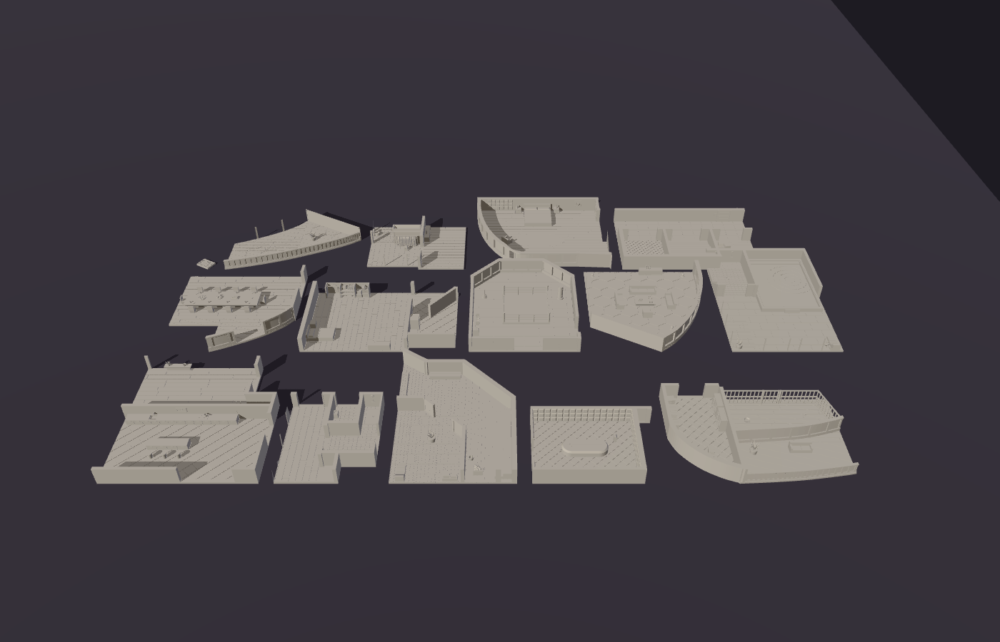

* **Seams follow walls.** Most seams run along a wall's face, so each wall stays whole on one tile.
  * The sensory chamber's west wall is the exception. It has padding on one face and the lock
    button on the other, so that seam runs down the middle of the wall and each half keeps its own
    face.
  * Some seams have to cross open floor, because big rooms don't fit the bed. These are the hallway
    (x = 307.5), the spa (under the hot tub's east wall), the dining room (two seams) and the
    balcony.
  * No furniture is cut by a seam.
  * A seam on a wall face would otherwise shave the door-frame lips and window mullions sticking
    past that face onto the next tile, as unprintable slivers. The build hands any piece under
    1.2 mm thick along a seam back to the tile that holds the rest of its wall, and reports any
    that remain (there are none).
  * The diagonal holo wall ends in a round pier at each end, where several walls meet. Each pier
    belongs to the holo tile, so the seam doesn't cross those junctions.
  * Every tile edge is pulled in by 0.01 mm. A wall face lying exactly on a seam would otherwise
    leave a zero-thickness "sheet" of that wall standing on the next tile. The part report checks
    each part for these sheets, and none are left.
* **Nothing overhangs.** Furniture sits on solid pedestals that flare out at a little over 45°.
  * Ropes, cage rails, shelves and window heads bridge less than 30 mm.
  * Window heads and the balcony handrail step out at 45° over their thin panes.
  * The report still lists these bridges and stepped rails. They are fine.
* **The painting** prints face up. The two diamond-section holes in its back fit diamond pegs on
  the wall (about 0.2 mm clearance), so neither the pegs nor the holes have flat undersides.
* **Filament:** most of the weight is floor. Low or Lightning infill brings it down (see
  [DESIGN_NOTES](../../DESIGN_NOTES.md)).
* The tiles just butt together on the table. There are no pins or clips yet.

## Files

```
plan.py       the traced floor plan: walls, doorways, rooms (a seed point and floor finish each), print-tile zones
shell.py      floor slab, floor patterns, solid and glass walls, doorways
props.py      furniture library (each prop in its own frame, front toward +Y)
details.py    what goes where: furniture, wall reliefs, hot tub, cage, painting and safe
penthouse.py  build(): everything, cut into tiles; main() writes output/ and the report
tilemap.py    the tile assembly diagram (images/tile_map.png)
```

To re-trace or adjust the plan, `tools/mapgrid.py` makes zoomed, gridded crops of a map image so
you can read coordinates straight off it. All the coordinates in `plan.py` are pixels of the
827 × 845 map crop.
