# The Star Theater (Malifaux)


Colette Du Bois' Star Theater, as tabletop terrain for Malifaux / D&D at ~32 mm heroic scale.
The battle map comes in two halves that face each other across the table:

1. **The stage:** `stage.py`
2. **The seating:** `seating.py`

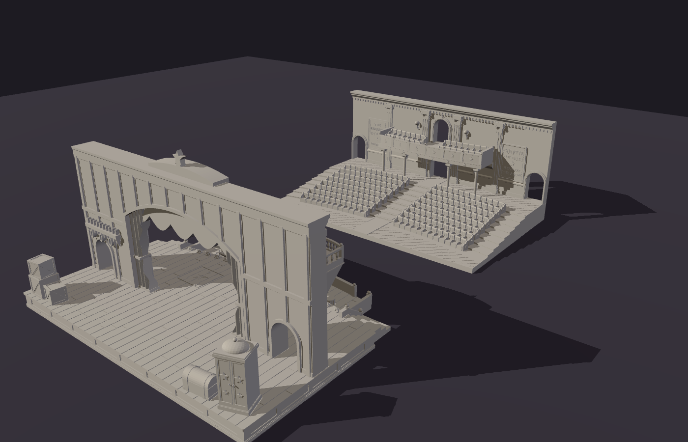

`python -m projects.star_theater.scene [gap_mm]` writes `theater_scene.stl` with the two halves set
out facing each other (the gap defaults to 150 mm). Each half is 400 mm wide. The stage is ~286 mm
deep including its orchestra pit, and the seating is 252 mm, so a 3' × 3' table leaves about 375 mm
for the gap.

## Part one: the stage

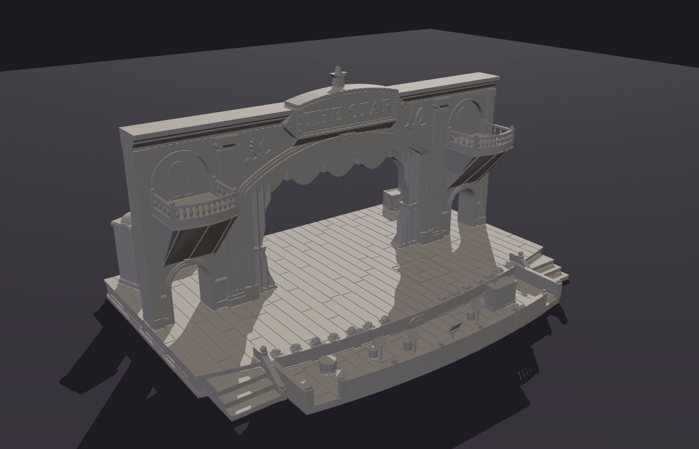

| Front | Backstage |
|---|---|
| 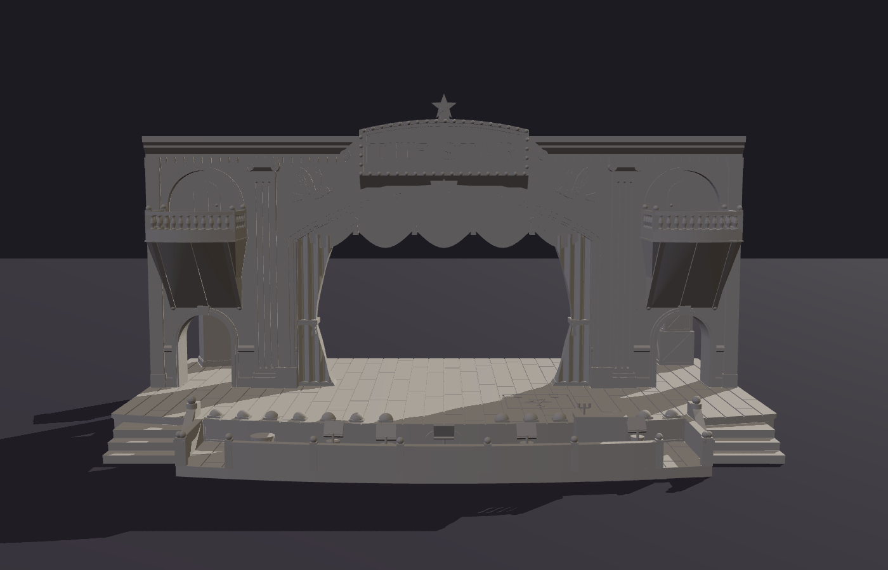 | 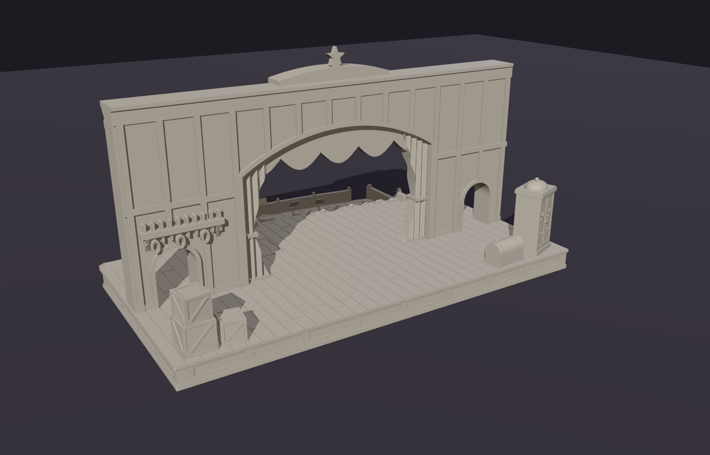 |
|  | 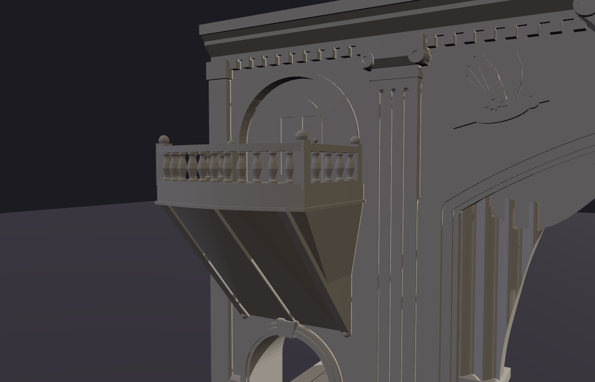 |
| 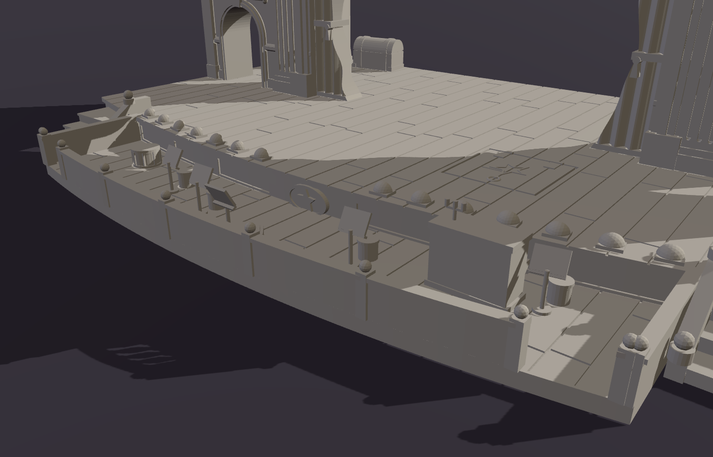 | 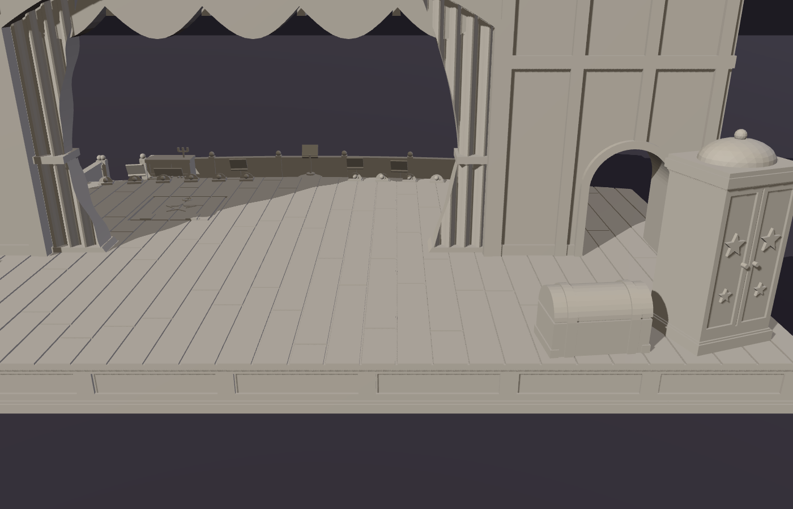 |

### What's on it

* **Stage base:** 400 × ~230 mm, 20 mm tall. The planked floor has staggered butt joints. A curved
  apron extends ~110 mm in front of the wall, with recessed skirt panels, a star medallion,
  shell-hooded footlights and a magician's trapdoor marked with a star. Three steps lead down
  from each front corner.
* **Orchestra pit:** a sunken pit, 55 mm deep, wraps around the front of the apron between the two
  staircases. Its plank floor is 14 mm below the stage.
  * Inside: an upright piano with a candelabra, the conductor's podium, four music stands with
    stools, and a drum.
  * A rail with ball-topped posts runs along the front, with a gate near each end.
* **Proscenium wall:** 20 mm thick and 170 mm above the deck, standing across the middle of the base.
  * The segmental arch opening is 200 mm wide and ~130 mm tall. It has a stepped moulding, a
    keystone, fluted pilasters, a dentil cornice, tied-back main drapes and a swagged valance
    with tassels.
  * The **"THE STAR"** marquee rises above the cornice, ringed with bulbs and topped with a star.
    Two of Colette's clockwork doves sit in relief on either side of it.
  * Each side wall has a **usable opera box**: a bowed balcony 108 mm above the deck with turned
    balusters and newel posts. Inside the rails it's about 52 × 44 mm, room for a 40 mm base.
    The top is open, so you can reach in to place models.
  * Under each box, a **36 × 50 mm door** leads backstage, so 30 mm bases fit through.
* **Backstage:** ~100 mm deep behind the wall. The back of the wall shows its timber framing
  and has a pin rail with coiled ropes. Props include stacked crates, a costume trunk and an
  illusionist's cabinet.

### Printing: 12 parts, already oriented

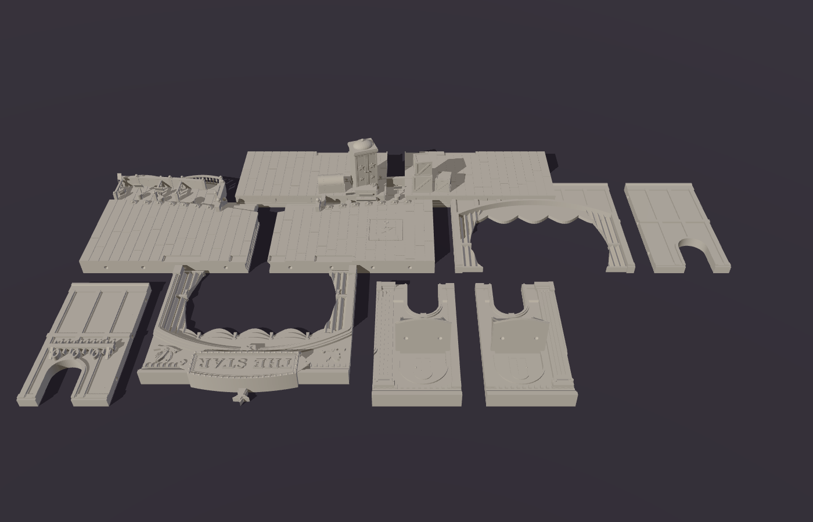

The model was designed around how it prints, so the seams fall where they're easy to hide and easy
to print. Run `python -m projects.star_theater.stage`. It writes `output/stage_assembled.stl`
(a preview of the whole thing) and the parts in `output/print/`. Each part is
already rotated into its print orientation and sitting on z = 0, so you can drop it straight into
the slicer.

| Part | Footprint (mm) | How it prints |
|---|---|---|
| `deck_front_left` / `_right` | 202 × 178 | flat, top up (includes the orchestra pit) |
| `deck_back_left` / `_right` | 202 × 108 | flat, top up (props included) |
| `wall_front_centre` | 218 × 201 | lying on its back: the split face on the bed, audience side up |
| `wall_front_left` / `_right` | 91 × 172 | lying on its back; the box bracket points up |
| `wall_back_centre` | 218 × 172 | lying on its front: split face down, backstage side up |
| `wall_back_left` / `_right` | 91 × 172 | lying on its front |
| `balcony_left` / `_right` | 58 × 52 | upright, so the balusters stand vertically |

"Left" and "right" are as seen from the audience. Everything fits a 220 × 220 mm bed, with room to
spare on the X1 Carbon's 256 mm bed.

**How it's split:**

* **The wall splits lengthwise** down its centre line (10 mm + 10 mm). Both halves print with the cut face
  on the bed, so all the relief faces up. Anything that hangs into an opening reaches back to the cut
  face, so nothing starts in mid-air: the curtains, the valance and its tassels, the marquee and its star.
  The curtains show folds on both sides.
* **The wall also splits into left, centre and right** at x = ±109 mm, just outside the arch, so the
  curtains stay whole on the centre piece.
* **The deck splits into quarters.** The front/back seam runs under the wall. The left/right seam falls
  on a plank line, and the trapdoor sits off-centre so the seam misses it.
* **The opera balconies print separately** and sit on brackets built into the wall's front half. Each
  bracket's underside slopes at about 45°.

**Joinery:**

* Every seam lines up with **4.5 mm steel BBs** (".177 caliber" airgun BBs, which are cheap in packs of
  thousands). Each face gets a half-sphere pocket, and the ball centres the two parts as they close.
  Glue the plastic faces as usual; the ball is trapped between them. Real BBs run about 4.35–4.5 mm.
  If yours differ, change `BALL_D` in `modelkit/csg.py` and rebuild. There are 8 per deck seam,
  10 between the wall halves, 6 per wall side seam, and 2 per balcony, plus one in the pit floor.
* The wall's **2 mm tenon** drops into a matching **slot in the deck**, with 0.2 mm clearance. The
  tenon also bridges the deck's front/back seam.
* Glue as you go. Suggested order: pin and glue the deck quarters together. Assemble each wall half,
  then glue the two halves together. Drop the wall into the deck slot, then pin the balconies on.

**Overhang check:** the build runs `modelkit/printcheck.py` on every part in its print
orientation. It reports any downward-facing surface steeper than 45° that isn't on the bed. What's
left is all small: 0.8 mm steps under the deck lip and the cabinet crown, the domed tops of the BB
pockets, crate bottoms crossing the floor grooves, the balcony top rail bridging ~5 mm between
balusters, a 0.6 mm lip on the piano lid, and the music-stand desks. The desks cantilever ~5 mm
either side of their posts; they're tiny, but a slow outer-wall speed helps there. No supports are
needed. The finest details are about 1.6 mm (baluster necks), which is fine for a
0.4 mm nozzle or resin.

## Part two: the seating

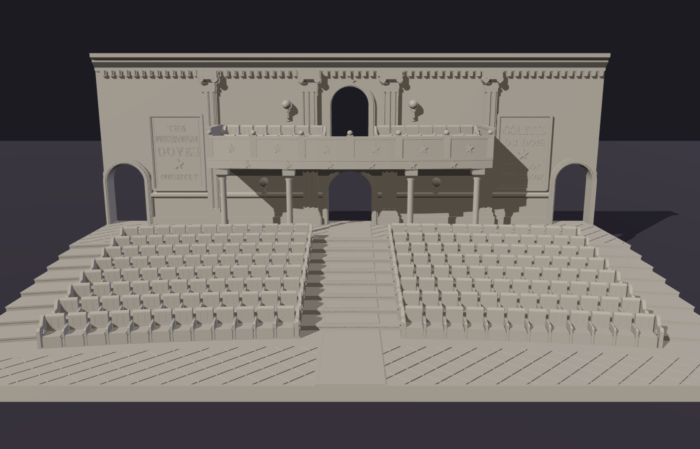

| Balcony | Under the balcony |
|---|---|
| 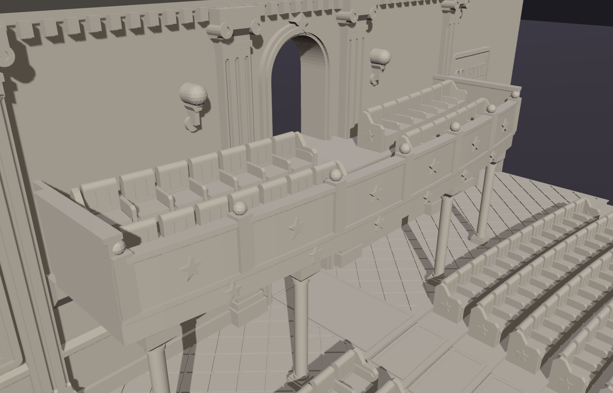 | 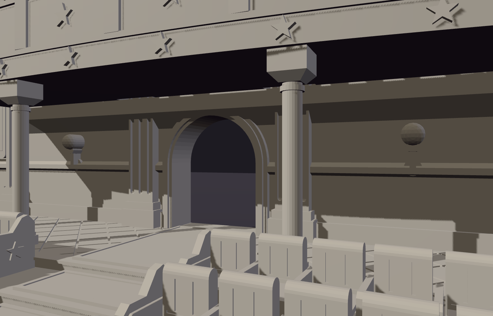 |
| 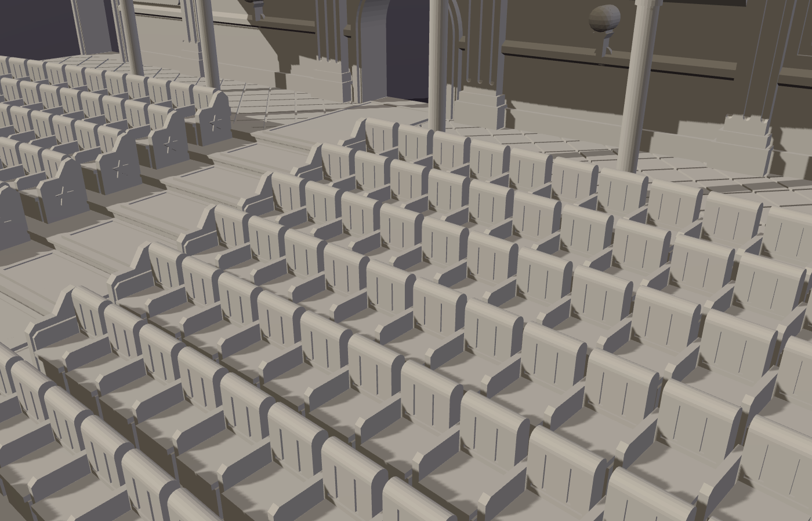 | 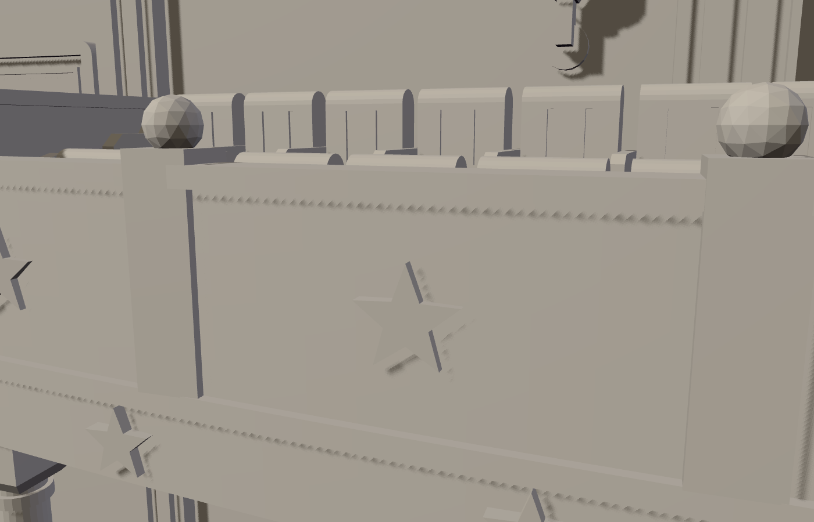 |

* **Eight close-packed rows** of velvet theatre chairs, 192 in all (plus 28 in the balcony). The rows are 17 mm apart,
  curve toward the stage, and each is 3 mm higher than the one in front. The chairs have tufted backs
  and armrests, with cast-iron end panels with stars on the aisles.
  * Models stand *on* the chairs: count them as difficult terrain that gives cover (the character
    is ducking down behind the seats). A base resting across two rows' chair backs tilts about 10°.
* **Wide aisles** are the fast way forward: a 44 mm centre aisle with a carpet runner, 32 mm side
  aisles, and a tiled cross aisle 35–50 mm deep along the front edge.
* **Rear walkway** with a diamond-tiled floor, behind the last row.
* **Balcony** over the walkway, for a ranged character or two.
  * About 210 × 46–54 mm, with two bowed rows of seats either side of a small centre aisle.
  * It sits behind a parapet with stars, ball-topped posts and a decorated front, with a door
    into the back wall.
  * Its floor is 84 mm up, and there's 52 mm of headroom on the walkway below.
  * It comes no further forward than the back row, so there's little reaching under.
  * It rests on four cast-iron columns and a ledge on the back wall, held in place by BBs. Leave it
    unglued and you can lift it off to reach the walkway.
* **Back wall**, matching the stage:
  * Pilasters, a dentil cornice and gas sconces.
  * A 36 mm double doorway under the balcony, and a 30 mm doorway at each side aisle.
  * Two framed playbills: *"COLETTE DU BOIS ★ STAR OF THE SHOW"* and
    *"THE MECHANICAL DOVES ★ NIGHTLY"*.

### Printing the seating: 8 parts

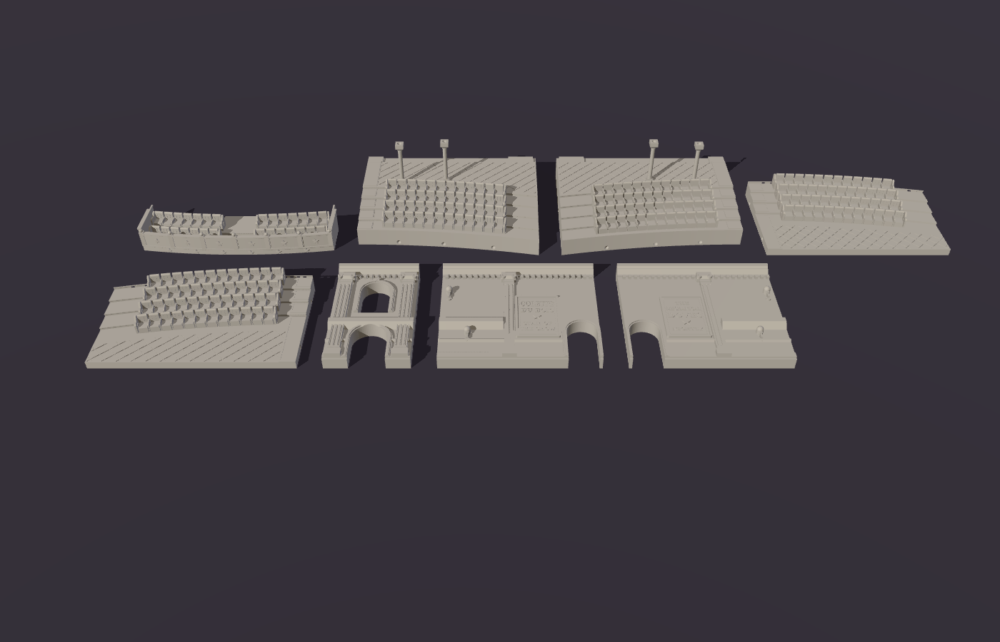

| Part | Footprint (mm) | How it prints |
|---|---|---|
| `seating_floor_front_left` / `_right` | 200 × 118 | flat (cross aisle, rows 1–4) |
| `seating_floor_back_left` / `_right` | 200 × 154 | flat (rows 5–8, walkway, columns) |
| `seating_wall_centre` | 84 × 138 | lying on its plain back, decoration up |
| `seating_wall_left` / `_right` | 158 × 138 | lying on its plain back; the balcony ledge points up |
| `seating_balcony` | 212 × 55 | flat on its underside |

* The floor splits down the centre aisle and along the front edge of row 5. That seam follows the
  curve and hides at the foot of a step.
* The columns print standing up on the back floor pieces: 4.6 mm shafts, 52 mm tall. Each capital
  has a 45° flare, and its top carries a BB pocket for the balcony.
* The back wall has a flat back (it faces the lobby, or the table edge), so it prints lying on it.
  It splits just outside the centre pilasters. The balcony ledge underneath slopes at 45°.
* Joinery is the same as the stage: BB pockets on every seam (4 on the aisle seam, 6 on the curved
  seam, 4 on the wall seams), and a wall tenon that drops into a slot in the walkway. The balcony
  takes 8 BBs: 4 on the column tops and 4 on the wall ledge.
* Overhang check: nothing needs supports. The only flags are the pocket domes.

## Coordinates

Units are millimetres. X runs left/right and Z is up. **+Y points toward the audience**. That holds
on the seating piece too, where y = 0 is its edge facing the stage. On the stage, the wall's
front face is at y = 0 and its back face at y = −20, with the split plane at y = −10. Viewed from
the audience, +X is on the viewer's *left*, so text on front-facing surfaces is mirrored in code
(`text_section(..., mirror=True)`).

## Building

From the repo root (see the [top-level README](../../README.md) for setup):

```sh
python -m projects.star_theater.stage        # stage: output/stage_assembled.stl + output/print/*.stl
python -m projects.star_theater.seating      # seating: output/seating_assembled.stl + output/print/seating_*.stl
python -m projects.star_theater.scene 150    # both halves, 150 mm apart: output/theater_scene.stl
```

Each build prints a report per part: footprint, height, solid volume, a rough filament estimate and any
overhangs. The whole theater is 20 parts and about 2.5 kg of PLA at 15% infill (about 1.9 kg at 5%, or less
with Lightning infill, which suits these flat-topped floors). Bambu Studio
lays it out as 12+ plates of ~8 hours each.

Files here: `stage.py` and `seating.py` (the two halves), `ornament.py` (pilasters and the clockwork
dove, shared by both), `props.py` (the orchestra-pit furniture) and `scene.py`.
